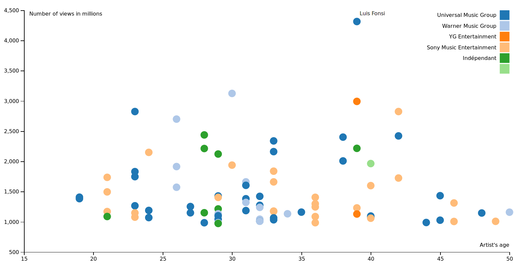

# Visualization_most_viewed_artists

## Visualization of most viewed songs from Youtube

This project aims to create a simple visualization about the artists whose songs have
been the most viewed on Youtube.

The dataset has several entries like name of the song, names of the artists but also the age,
the sexe, the origin of the artists etc.

The visualization shows the age of the artists according their number of views plus the parent
label of the artists and their name when moving the mouse on the dots.

What needs to be improved : some artists appear several times, it should rather sum up the views.

